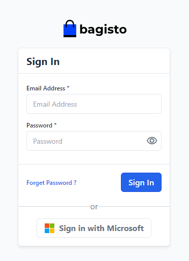

<div align="center">
    
    <h2>Azure single sign-on (SSO)</h2>
</div>

<div align="center">
    
    
</div>

With this package, you can integrate Microsoft Azure Single Sign-On (SSO) into the Bagisto admin panel.  
When using Microsoft Azure SSO for your Bagisto eCommerce Admin Authentication, you benefit from the following features.

1. **Centralized Authentication:**
   - With Azure SSO, users can use a single set of credentials to access various applications, including Bagisto. This simplifies the management of login credentials for both users and administrators.

2. **Enhanced Security:**
   - Azure SSO utilizes modern security protocols and provides additional security layers, such as multi-factor authentication (MFA).  
This strengthens the security of the login process.

3. **User Convenience:**
   - Users experience improved convenience by only having to log in once to access various applications, including Bagisto.  
This increases productivity and reduces the risk of password loss or forgetfulness.

4. **Integration with Existing Azure Infrastructure:**
   - Businesses already using Azure as their cloud infrastructure can benefit from seamless integration with Azure SSO.  
This helps streamline authentication processes within the existing Azure environment.

5. **Monitoring and Reporting:**
   - Azure SSO provides comprehensive monitoring and reporting capabilities. Administrators can gain insights into user activity, login attempts, and other relevant data, aiding in security management and issue resolution.

6. **Scalability:**
   - Azure SSO is designed to be scalable and can be tailored to the growing needs of an organization.  
Whether you are a small business starting with Bagisto or a larger enterprise requiring scalability, Azure SSO can provide the necessary adjustments.

## Changelog

See [Changelog](CHANGELOG.md) for details on what has changed in each version.

## Installation

1. Install the package using Composer

```bash
    composer require bagisto-eu/azure-auth
```

2. Run the following command to configure your credentials

```bash
    php artisan azure:configure
```

During the configuration, you will be prompted to enter your Client ID, Client Secret, and Tenant ID.  
If you don't have these credentials, you can obtain them at [https://portal.azure.com](https://portal.azure.com).  

3. Open your admin panel you should see the option to Sign in with Microsoft



## Support

For support or any inquiries, please contact us at [info@bagisto.eu](mailto:info@bagisto.eu).
